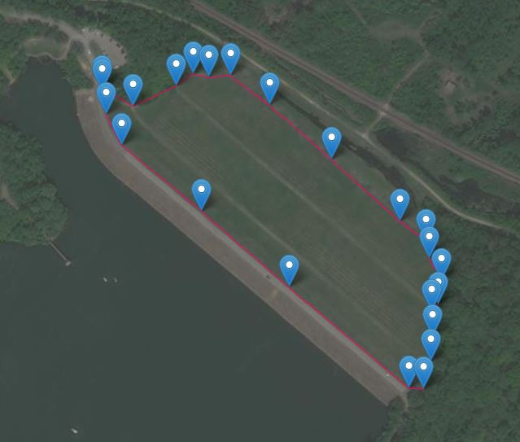
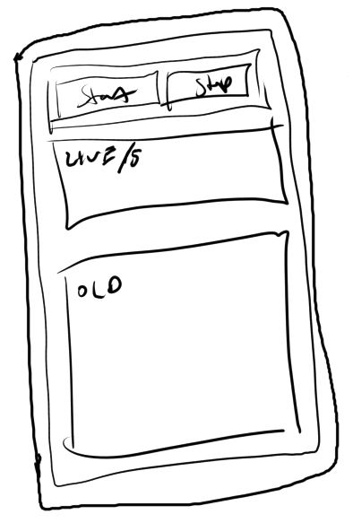
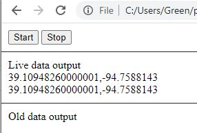

### 04/06/2021
I'm about to go on a ~1.5 mile run-jog, target is below: (using Daft Logic's distance calculator)

Anyway I was motivated to do this because the app I used to use was acquired by some company and I was like okay fine, can I just buy it once. No it's either free with ads or you pay a subscription. Like nah chief.

So yeah I'm going to make a piece of crap one... anyway more exposure to imu related.

It seems like all the stuff I want (GPS, IMU) are accesible even directly by web, so I will make a stupid interface/host it on GPages and run/gather some data. I can't do any processing now but my concern is storing data against localStorage for the time that I run. Despite one lap being 0.7 miles, after I sprint the road part (bottom to top) then I'm pretty much sucking wind... till I get to the next straight away, run half of it... sucking wind... then I sprint up the hill which is nice. Then I feel my lungs burn, like they were being deep fried with some panko.

This will become an RN app as I have to deploy some.

Two buttons, start/stop and then live data stream to make sure it's working and then old data when I stop/start, see they're being stored.

A concern is how much data I can store, I think 1 second at a time is not bad... maybe 2 seconds. But yeah I think my limit is 2.5MB and not sure with the length of the floats how much each row will take up.

 Right now I weigh 260lbs insane... normally I'm in the 220's, ideal is 205-215. I'm super cut in the low 200's.

 Working at home for so long like I haven't had to fit in my own clothes or anything except for the biggest ones.

 Going to kick off this github pages... gotta get this prototype done in like 50 mins or less so I can have some daylight left to actually run.

 My fear is it will stop working/not collect data.

 How it works is every say 100 seconds it will push a group into the localStorage so that I don't have to worry about the variables getting too big/accidentally losing data.

 I'll have to piece the data together later.

 Oh I need a way to export this data though hmm...

 Maybe I can add the UI update later and pull it from localStorage still

 Ahh I don't know what to make of these different sensors looks like some take out gravity for example, some combine... also this ticking thing vs. on demand (what I wanted)

 Crap I'm out of time, need to just get location data

 Ugh I'm out of time, running is what matters, I gotta get out there

 

 Gotta turn on the Omni-man song where he murders the Flaxan planet